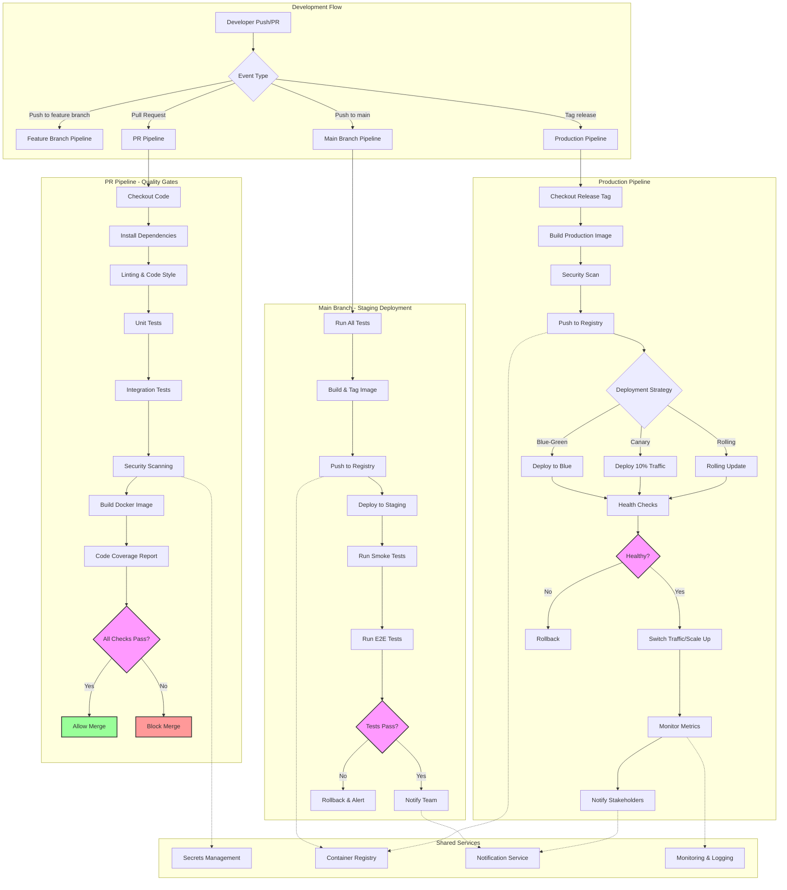

# CI/CD for Django

```mermaid
graph TB
    subgraph "Development Flow"
        A[Developer Push/PR] --> B{Event Type}
        B -->|Push to feature branch| C[Feature Branch Pipeline]
        B -->|Pull Request| D[PR Pipeline]
        B -->|Push to main| E[Main Branch Pipeline]
        B -->|Tag release| F[Production Pipeline]
    end

    subgraph "PR Pipeline - Quality Gates"
        D --> D1[Checkout Code]
        D1 --> D2[Install Dependencies]
        D2 --> D3[Linting & Code Style]
        D3 --> D4[Unit Tests]
        D4 --> D5[Integration Tests]
        D5 --> D6[Security Scanning]
        D6 --> D7[Build Docker Image]
        D7 --> D8[Code Coverage Report]
        D8 --> D9{All Checks Pass?}
        D9 -->|Yes| D10[Allow Merge]
        D9 -->|No| D11[Block Merge]
    end

    subgraph "Main Branch - Staging Deployment"
        E --> E1[Run All Tests]
        E1 --> E2[Build & Tag Image]
        E2 --> E3[Push to Registry]
        E3 --> E4[Deploy to Staging]
        E4 --> E5[Run Smoke Tests]
        E5 --> E6[Run E2E Tests]
        E6 --> E7{Tests Pass?}
        E7 -->|Yes| E8[Notify Team]
        E7 -->|No| E9[Rollback & Alert]
    end

    subgraph "Production Pipeline"
        F --> F1[Checkout Release Tag]
        F1 --> F2[Build Production Image]
        F2 --> F3[Security Scan]
        F3 --> F4[Push to Registry]
        F4 --> F5{Deployment Strategy}
        F5 -->|Blue-Green| F6[Deploy to Blue]
        F5 -->|Canary| F7[Deploy 10% Traffic]
        F5 -->|Rolling| F8[Rolling Update]
        F6 --> F9[Health Checks]
        F7 --> F9
        F8 --> F9
        F9 --> F10{Healthy?}
        F10 -->|Yes| F11[Switch Traffic/Scale Up]
        F10 -->|No| F12[Rollback]
        F11 --> F13[Monitor Metrics]
        F13 --> F14[Notify Stakeholders]
    end

    subgraph "Shared Services"
        S1[Secrets Management]
        S2[Container Registry]
        S3[Notification Service]
        S4[Monitoring & Logging]
    end

    D6 -.-> S1
    E3 -.-> S2
    F4 -.-> S2
    E8 -.-> S3
    F14 -.-> S3
    F13 -.-> S4

    style D9 fill:#f9f,stroke:#333,stroke-width:2px
    style E7 fill:#f9f,stroke:#333,stroke-width:2px
    style F10 fill:#f9f,stroke:#333,stroke-width:2px
    style D10 fill:#9f9,stroke:#333,stroke-width:2px
    style D11 fill:#f99,stroke:#333,stroke-width:2px
```
